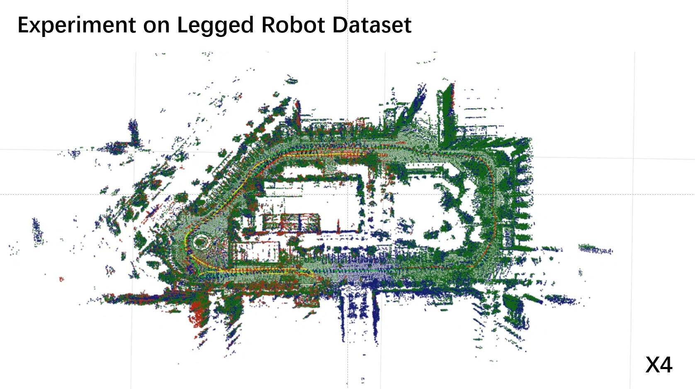
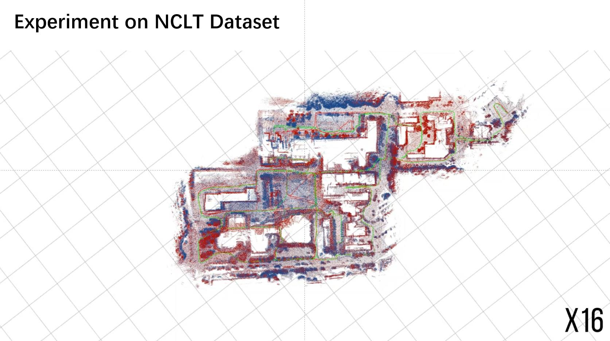

<!-- PROJECT LOGO -->
<br />
<div align="center">
  <a href="https://github.com/MaverickPeter/MR_SLAM">
    
  </a>
<h2 align="center">MR_SLAM</h2>

  <p align="center">
    A modularized multi-robot SLAM system with elevation mapping and a costmap converter for easy navigation. Different odometry and loop closure algorithms can be easily integrated into the system.
    <br />
    <br />
    <a href="https://youtu.be/HY3bIPKINwk">View Demo</a>
    ·
    <a href="https://github.com/MaverickPeter/MR_SLAM/issues">Report Bug</a>
    ·
    <a href="https://github.com/MaverickPeter/MR_SLAM/issues">Request Feature</a>
  </p>
</div>

<div align="center">
<a href="https://youtu.be/HY3bIPKINwk" target="_blank"></a>
<a href="https://youtu.be/MbjN_9PfxK0" target="_blank"></a>
</div>

<!-- TABLE OF CONTENTS -->
<details>
  <summary>Table of Contents</summary>
  <ol>
    <li>
      <a href="#about-the-project">About The Project</a>
    </li>
    <li>
      <a href="#getting-started">Getting Started</a>
      <ul>
        <li><a href="#prerequisites">Prerequisites</a></li>
        <li><a href="#installation">Installation</a></li>
      </ul>
    </li>
    <li><a href="#quick-demo">Quick Demo</a></li>
    <li><a href="#full-usage">Full Usage</a></li>
    <li><a href="#docker">Docker</a></li>
    <li><a href="#roadmap">Roadmap</a></li>
    <li><a href="#citation">Citation</a></li>
    <li><a href="#contributing">Contributing</a></li>
    <li><a href="#license">License</a></li>
    <li><a href="#contact">Contact</a></li>
  </ol>
</details>


<!-- ABOUT THE PROJECT -->
## **About The Project**

This is a C++ library with ROS interfaces to manage multi-robot maps. It contains a pluggable front-end [FAST-LIO2](https://github.com/hku-mars/FAST_LIO), pluggable loop closure methods [DiSCO](https://github.com/MaverickPeter/DiSCO-pytorch) / [RING](https://arxiv.org/abs/2204.07992) / [ScanContext](https://ieeexplore.ieee.org/document/8593953). and a global manager that handles submaps, loop candidates and optimization results. The optimizer is mainly based on [GTSAM](https://github.com/borglab/gtsam) and [dist-mapper](https://github.com/CogRob/distributed-mapper). The system provides a 3D pointcloud map and an optional 2.5D elevation map output. The output elevation map can be easily converted to a costmap for navigation.

**Author: Peter XU (Xuecheng XU)<br />
Affiliation: [ZJU-Robotics Lab](https://github.com/ZJU-Robotics-Lab)<br />
Maintainer: Peter XU, xuechengxu@zju.edu.cn<br />**

<p align="right">(<a href="#readme-top">back to top</a>)</p>


## **NEWS (July, 2023): Support RING++ in LoopDetection**
(July, 2023) Support RING++ in LoopDetection.

(April, 2023) Support single robot application.

(Jan, 2023) Support PCM (Pairwise Consistent Measurement) for robustness.

A chinese version of [Tutorial](https://maverickpeter.github.io/2022/11/03/MR_SLAM-tutorial/) is posted on my blog. 

<!-- GETTING STARTED -->
## **Getting Started**

Here, we provide an example to demonstrate the system. Some parameters can be changed to fit your needs.

### **Prerequisites**

This software is built on the Robotic Operating System ([ROS](http://wiki.ros.org) tested on kinetic and melodic), which needs to be [installed](http://wiki.ros.org/ROS/Installation) first. Additionally, the MR_SLAM depends on following software:

* [Eigen](http://eigen.tuxfamily.org) (linear algebra library, tested on 3.2.9 & 3.3.4; elevation_mapping failed on 3.3.9)
  
* [CUDA](https://developer.nvidia.com/cuda-toolkit) (gpu process)
  
* [Cython](https://github.com/cython/cython) (C extensions for Python)

* [GTSAM](https://github.com/borglab/gtsam) (pose optimization, tested on 4.0.0-alpha2)

* [Grid Map](https://github.com/anybotics/grid_map) (grid map library for mobile robots)
  ```sh
  sudo apt install ros-$ROS_DISTRO-grid-map*
  ```
* [DiSCO](https://github.com/MaverickPeter/DiSCO-pytorch) (pluggable loop detector)
  ```sh
  Follow https://github.com/MaverickPeter/DiSCO-pytorch
  You can also use c++ version in LoopDetection/src/disco_ros/tools/multi-layer-polar-cpu/
  ```
* [RING & RING++](https://github.com/MaverickPeter/MR_SLAM/tree/main/LoopDetection/src/RING_ros) (pluggable loop detector)
  ```sh
  Follow the README in LoopDetection/src/RING_ros
  ```
* [livox_ros_driver](https://github.com/Livox-SDK/livox_ros_driver) (for FAST_LIO2)
  ```sh
  Follow https://github.com/Livox-SDK/livox_ros_driver
  ```
* [Fast GICP](https://github.com/SMRT-AIST/fast_gicp) (for ICP refine)
  ```sh
  # Fast GICP is already include in the repo. You can use 
  git submodule sync
  git submodule update --init --recursive

  # or you can clone the repo and put them in the same place
  Follow https://github.com/SMRT-AIST/fast_gicp
  ```
* (optional - for elevation_mapping) [OctoMap](https://github.com/OctoMap/octomap) (octomap library for multi-resolution)
  ```sh
  sudo apt install ros-$ROS_DISTRO-octomap*
  ```
* (optional - for elevation_mapping) [Kindr](https://github.com/anybotics/kindr)
  ```sh
  Follow https://github.com/anybotics/kindr
  ```
* (optional - for docker use) [nvidia-docker](https://docs.nvidia.com/datacenter/cloud-native/container-toolkit/install-guide.html#docker)


### **Installation**

1. Clone the repo
   ```sh
   git clone https://github.com/MaverickPeter/MR_SLAM.git
   ```
2. Make Mapping 
   ```sh
   cd Mapping && catkin_make -DBUILD_PYTHON_BINDINGS=ON
   ```
3. Make Localization 
   ```sh
   cd Localization && catkin_make
   ```
4. Make Costmap 
   ```sh
   cd Costmap && catkin_make
   ```
5. Make LoopDetection 
   ```sh
   cd LoopDetection && catkin_make -DBUILD_PYTHON_BINDINGS=ON

   # If you encounter the PyInit__tf2 issue, use catkin_make with your python3 environment
   catkin_make --cmake-args \
   -DCMAKE_BUILD_TYPE=Release -DPYTHON_EXECUTABLE=/home/client/miniconda3/envs/py3/bin/python3.8 \
   -DPYTHON_INCLUDE_DIR=/home/client/miniconda3/envs/py3/include/python3.8 \
   -DPYTHON_LIBRARY=/home/client/miniconda3/envs/py3/lib/libpython3.8.so \
   -DBUILD_PYTHON_BINDINGS=ON
   ```

<p align="right">(<a href="#readme-top">back to top</a>)</p>


<!-- QUICKDEMO -->
## **Quick Demo**
1. Get rosbag from [Google Drive](https://drive.google.com/file/d/1KNrzvpfeuiQ8i-zUvlKbsn-iTIPJOQh8/view?usp=sharing) or [Baidu Pan](https://pan.baidu.com/s/1dcDRyn-G7TilFpc8shLQNA?pwd=gupx) with **extract code: gupx**

2. Run roscore
   
3. Run bag
   ```sh
   rosbag play 3_dog.bag --clock --pause
   ```
4. Run DiSCO / RING / Scan Context (If you encountered the error 'ImportError: dynamic module does not define module export function' you can refer to https://github.com/MaverickPeter/MR_SLAM/issues/4)
   ```sh
   # !!!!! You need to change the Python interpreter to your environment The default is mine: #!/home/client/miniconda3/envs/disco/bin/python3

   cd LoopDetection && source devel/setup.bash
   
   # DiSCO
   rosrun disco_ros main.py
   
   # Scan Context
   cd src/RING_ros
   python main_SC.py

   # RING: If you encounter the PyInit__tf2 issue, use catkin_make with your python3 environment. Check installation section. 
   cd src/RING_ros
   python main_RING.py
  
   # or RING++
   python main_RINGplusplus.py

   # Note that if you add #!/home/client/miniconda3/envs/disco/bin/python3 in the first line of RING_ros/main.py you can also use rosrun RING_ros main.py to start the node.
   ```
5. Run global_manager 
   ```sh
   cd Mapping && source devel/setup.bash
   roslaunch global_manager global_manager.launch
   ```
6. Visualization
   ```sh
   rviz -d Visualization/vis.rviz
   ```

<p align="right">(<a href="#readme-top">back to top</a>)</p>


<!-- FULLUSAGE -->
## **Full Usage**
1. Get rosbag from [Google Drive](https://drive.google.com/drive/folders/1YTdVwVDLlgObInfSGmzvZctelvJ7O8E4?usp=sharing) and decompress the bags using 
    ```sh
    rosbag decompress xxx.bag
   ```
   
2. Run roscore

3. Run bags (in 3 terminals)
   ```sh
   rosbag play loop_22.bag --clock --pause
   rosbag play loop_30.bag 
   rosbag play loop_31.bag 
   ```
4. Run fast-lio (in 3 terminals)
   ```sh
   # Set parameters in Localization/src/FAST_LIO/launch/ and Localization/src/FAST_LIO/config/ !!You need to set the scan_publish_en to true to send submaps

   cd Localization && source devel/setup.bash
   roslaunch fast_lio robot_1.launch
   roslaunch fast_lio robot_2.launch
   roslaunch fast_lio robot_3.launch
   ```
5. Run elevation_mapping (in 3 terminals)
   ```sh
   # Set parameters in Mapping/src/elevation_mapping_periodical/elevation_mapping_demos/launch/ and Mapping/src/elevation_mapping_periodical/elevation_mapping_demos/config/

   cd Mapping && source devel/setup.bash
   roslaunch elevation_mapping_demos robot_1.launch
   roslaunch elevation_mapping_demos robot_2.launch
   roslaunch elevation_mapping_demos robot_3.launch   
   ```
6. Run preprocess tools (in 3 terminals)
   ```sh
   # If robots don't have cameras, you have to create fake images for elevation_mapping

   cd Tool/Fake_img
   python robot_1.py
   python robot_2.py
   python robot_3.py

   # If robots' point cloud are too large for real-time processing, you have to launch filters to accelerate.

   cd Tool/Filters
   roslaunch filter_robot_1.launch   
   roslaunch filter_robot_2.launch   
   roslaunch filter_robot_3.launch   

   ```
7. Run loop detection module
   ```sh
   # You need to change the Python interpreter to your environment The default is mine: #!/home/client/miniconda3/envs/disco/bin/python3

   cd LoopDetection && source devel/setup.bash
   
   # DiSCO
   rosrun disco_ros main.py
   
   # RING
   cd src/RING_ros
   python main_RING.py

   # or RING++
   python main_RINGplusplus.py
   ```
8. Run global_manager 
   ```sh
   # Set parameters in Mapping/src/global_manager/launch/

   cd Mapping && source devel/setup.bash
   roslaunch global_manager global_manager.launch
   ```
9. Run costmap converter 
   ```sh
   # Set parameters in Costmap/src/costmap/params/

   cd Costmap && source devel/setup.bash
   roslaunch move_base move_base_server.launch
   ```
10. Visualization
    ```sh
    rviz -d Visualization/vis.rviz
    ```

<p align="right">(<a href="#readme-top">back to top</a>)</p>


<!-- DOCKER -->
## **Docker**

- Build docker from Dockerfile.
  1. sudo bash build.sh
  2. sudo bash run.sh (Set your own directory in run.sh to allow container to access part of your filesystem)
  3. sudo bash login.sh
  4. In docker, the codes are deployed in /home directory. You can follow the usage above to start nodes.

- or you can just pull our docker from dockerhub.
  ```sh
  docker pull maverickp/mrslam:noetic
  ```

<!-- ROADMAP -->
## **Roadmap**

- [x] Add PCM.
- [ ] Optimize code.
- [ ] Add more pluggable loop closure methods.
- [ ] Support more front-end odometry.

See the [open issues](https://github.com/MaverickPeter/MR_SLAM/issues) for a full list of proposed features (and known issues).

<p align="right">(<a href="#readme-top">back to top</a>)</p>


<!-- CITATION -->
## **Citation**
If you find this repo useful to your project, please consider to cite it with following bib:

    @article{xu2022ring++,
          title={RING++: Roto-translation Invariant Gram for Global Localization on a Sparse Scan Map},
          author={Xu, Xuecheng and Lu, Sha and Wu, Jun and Lu, Haojian and Zhu, Qiuguo and Liao, Yiyi and Xiong, Rong and Wang, Yue},
          journal={arXiv preprint arXiv:2210.05984},
          year={2022}
    }

    @article{xu2021disco,
          title={Disco: Differentiable scan context with orientation},
          author={Xu, Xuecheng and Yin, Huan and Chen, Zexi and Li, Yuehua and Wang, Yue and Xiong, Rong},
          journal={IEEE Robotics and Automation Letters},
          volume={6},
          number={2},
          pages={2791--2798},
          year={2021},
          publisher={IEEE}
    }

<!-- CONTRIBUTING -->
## **Contributing**

Contributions are what make the open source community such an amazing place to learn, inspire, and create. Any contributions you make are **greatly appreciated**.

If you have a suggestion that would make this better, please fork the repo and create a pull request. You can also simply open an issue with the tag "enhancement".
Don't forget to give the project a star! Thanks again!

1. Fork the Project
2. Create your Feature Branch (`git checkout -b feature/AmazingFeature`)
3. Commit your Changes (`git commit -m 'Add some AmazingFeature'`)
4. Push to the Branch (`git push origin feature/AmazingFeature`)
5. Open a Pull Request

<p align="right">(<a href="#readme-top">back to top</a>)</p>


<!-- LICENSE -->
## **License**

Distributed under the MIT License. See `LICENSE.txt` for more information.

<p align="right">(<a href="#readme-top">back to top</a>)</p>


<!-- CONTACT -->
## **Contact**

Xuecheng Xu - xuechengxu@zju.edu.cn

Project Link: [https://github.com/MaverickPeter/MR_SLAM](https://github.com/MaverickPeter/MR_SLAM)

<p align="right">(<a href="#readme-top">back to top</a>)</p>
